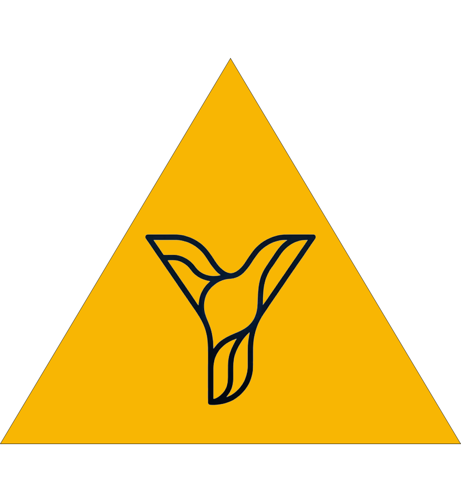
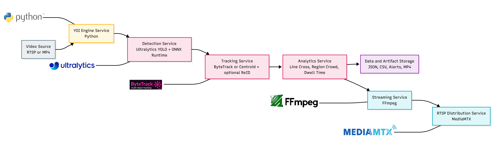

  

<h1 align="center" style="margin: 0; line-height: 1.1;">YOI Vision Engine</h1>

> Real-Time Vision Analytics Platform

YOI is a production-grade analytics engine for real-time detection, multi-object tracking, event intelligence, and streaming-ready output.

| Release Info | Value |
| --- | --- |
| Version | `v0.1` |
| Release Date | `2026-02-16` |
| Maintainer | `hafizalfariz` |

## Highlights

- Real-time detection and multi-object tracking pipeline for video and RTSP inputs.
- Built-in analytics modules: line crossing, region crowd monitoring, and dwell-time alerts.
- Deployment-ready with Docker Compose profiles for `cpu`, `gpu`, and `builder`.
- Structured outputs for operations: annotated media, JSON/CSV artifacts, and runtime logs.

## Quickstart Guide

1. Copy `.env.example` to `.env` and set required runtime values.
2. Put input video in `input/` and model weights in `models/<model_name>/1/`.
3. Ensure active YAML config is available in `configs/app/`.
4. Run CPU: `docker compose --profile cpu up -d --build`.
5. Run GPU: `docker compose --profile gpu up -d --build`.

## Overview

- The Runtime Engine (`src/`, `yoi/`) processes frames end-to-end: detection, tracking, analytics, and export.
- The Config Builder (`config_builder/`) creates valid YAML runtime configs and saves them to `configs/app`.
- Deployment is profile-based (`cpu`, `gpu`, `builder`) through Docker Compose.
- Runtime artifacts are separated cleanly across `input/`, `output/`, `logs/`, `configs/`, and `models/`.

Flowchart detail (service map + full runtime flow) and explanations are documented in:
- [docs/documentation/runtime-flow.md](docs/documentation/runtime-flow.md)

## Analytics Features

- Line Crossing: Counts directional crossing events (`in`, `out`, and net count) using tracked object trajectories against configured lines.
- Region Crowd: Measures object density inside configured polygon regions and emits threshold-based state updates.
- Dwell Time: Measures how long tracked objects stay inside target regions and raises alerts when duration thresholds are exceeded.

Tracking is identity-based (ByteTrack-first with centroid fallback, optional lightweight ReID), so feature metrics are tied to persistent object IDs rather than frame-only detections.

## Runtime Pipeline

- Input Layer: Reads video files (including common formats such as `.mp4` and `.avi`) or RTSP streams, then yields frames sequentially.
- Inference Layer: Loads YOLO automatically at startup and performs per-frame detection (with optional frame-skip tuning for performance mode).
- Tracking Layer: Associates detections across frames to maintain object identity continuity.
- Feature Layer: Applies line-crossing, crowd, and dwell-time logic on tracked objects with configurable thresholds.
- Output Layer: Produces annotated video and structured artifacts (`JSON`, `CSV`, and processing logs).
- Streaming Layer: Publishes annotated output to RTSP via FFmpeg and MediaMTX.

## Compose Profiles

- `cpu`: `app-yoi-cpu` and `mediamtx` for standard runtime.
- `gpu`: `app-yoi-gpu` and `mediamtx` for accelerated runtime.
- `builder`: `config-builder` for configuration authoring and save.

## High-Level Structure

- `src/`: Engine application entrypoint (main loop).
- `yoi/`: Core engine modules (inference, tracking, analytics, pipeline).
- `config_builder/`: Config Builder API and UI.
- `configs/app/`: YAML runtime configurations.
- `docker/`: Dockerfiles for CPU, GPU, and Builder services.
- `docs/assets/engine/`: Flowchart images and visual assets.
- `input/`: Source video files.
- `output/`: Generated artifacts (CSV, JSON, media outputs).
- `logs/`: Runtime logs.
- `tests/`: Automated test suite.

## Docker Compose Commands

### CPU Runtime

1. First run (build): `docker compose --profile cpu up -d --build`
2. Next runs (no rebuild): `docker compose --profile cpu up -d`
3. No-build with latest local code (dev override): `docker compose -f docker-compose.yml -f docker-compose.dev.yml --profile cpu up -d --no-build`
4. Logs (standard): `docker compose logs -f app-yoi-cpu`
5. Optional details:
   - App with tail: `docker compose logs --tail 200 -f app-yoi-cpu`
   - MediaMTX logs: `docker compose logs -f mediamtx`
6. Verify startup profile line: `Runtime     : profile=cpu ...`
7. Stop profile: `docker compose --profile cpu down`

### GPU Runtime

1. First run (build): `docker compose --profile gpu up -d --build`
2. Next runs (no rebuild): `docker compose --profile gpu up -d`
3. No-build with latest local code (dev override): `docker compose -f docker-compose.yml -f docker-compose.dev.yml --profile gpu up -d --no-build`
4. Logs (standard): `docker compose logs -f app-yoi-gpu`
5. Optional details:
   - App with tail: `docker compose logs --tail 200 -f app-yoi-gpu`
   - MediaMTX logs: `docker compose logs -f mediamtx`
6. Verify startup profile line: `Runtime     : profile=gpu ...`
7. Stop profile: `docker compose --profile gpu down`

## Devtools Workflow

Devtools command details are maintained in docs only:

- [Devtools Command Mapping](docs/documentation/devtools-command-mapping.md)

### Config Builder Commands

1. First run (build): `docker compose --profile builder up -d --build config-builder`
2. Next runs: `docker compose --profile builder up -d config-builder`
3. Logs: `docker compose logs -f config-builder`
4. Stop service only: `docker compose stop config-builder`
5. Stop builder profile: `docker compose --profile builder down`

## Service Control Scope

- Stop one service only:
  - Engine CPU: `docker compose stop app-yoi-cpu`
  - Engine GPU: `docker compose stop app-yoi-gpu`
  - MediaMTX: `docker compose stop mediamtx`
  - Builder: `docker compose stop config-builder`
- Down one profile stack:
  - CPU: `docker compose --profile cpu down`
  - GPU: `docker compose --profile gpu down`
  - Builder: `docker compose --profile builder down`
- Down all active services in the project: `docker compose down`

## Error-Only Log Filtering

- Linux/macOS/Git Bash: `docker compose logs -f app-yoi-cpu | grep -Ei "error|exception|traceback"`
- PowerShell: `docker compose logs -f app-yoi-cpu | Select-String -Pattern "error|exception|traceback"`

## Flowchart Assets

- Service Map Image: `docs/assets/engine/flowcharts/yoi_service.png`
- Detailed Runtime Flowchart: `docs/assets/engine/flowcharts/yoi_flowchart.png`
- Flowchart explanation and reading guide: [docs/documentation/runtime-flow.md](docs/documentation/runtime-flow.md)

## Documentation

Detailed guides are available in:

- [docs/documentation/before-run-checklist.md](docs/documentation/before-run-checklist.md)
- [docs/documentation/deployment.md](docs/documentation/deployment.md)
- [docs/documentation/architecture.md](docs/documentation/architecture.md)
- [docs/documentation/configuration-builder.md](docs/documentation/configuration-builder.md)
- [docs/documentation/runtime-flow.md](docs/documentation/runtime-flow.md)
- [docs/documentation/operations.md](docs/documentation/operations.md)
- [docs/documentation/devtools-command-mapping.md](docs/documentation/devtools-command-mapping.md)

### Audience Guide

| Role | Document |
|---|---|
| Solution Architect | [architecture.md](docs/documentation/architecture.md) |
| Integrator / QA | [configuration-builder.md](docs/documentation/configuration-builder.md) |
| Reviewer / Engineer | [runtime-flow.md](docs/documentation/runtime-flow.md) |
| Operator / DevOps | [operations.md](docs/documentation/operations.md) |

Local development details, QA workflow, and no-rebuild strategy are intentionally placed in the documentation files above, not in this main README.
