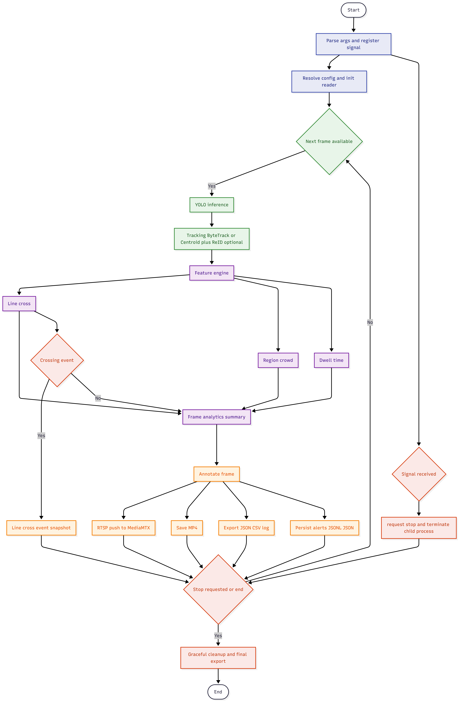

# Runtime Flow

This document explains the operational flow of the YOI engine, from startup to graceful shutdown.

## Audience and Use

- Audience: Engineers, reviewers, and technical stakeholders.
- Use this document to understand execution stages, data movement, and shutdown behavior.

## Purpose

- Describe execution behavior from initialization to teardown.
- Provide a readable interpretation of runtime flowcharts.
- Align service-level flow with process-level runtime stages.

## Flowchart Assets

### 1) YOI Service Map

This diagram shows **service boundaries** and how data moves between external source, engine modules, streaming layer, and storage.

Use this map when reviewing integration points (input source, MediaMTX, output artifacts, and service ownership).

### 2) YOI Full Runtime Flowchart

This diagram shows **internal engine execution flow** from startup, config resolution, frame loop, analytics, output, until graceful shutdown.

Use this flowchart when debugging runtime stages, ordering of processing steps, or shutdown behavior.

## Service-Level Flow

The **YOI Service Map** represents integration boundaries between core services:

1. Video Source provides RTSP or MP4 input.
2. YOI Engine coordinates inference, tracking, and analytics.
3. Detection Service runs YOLO inference.
4. Tracking Service maintains object identity across frames.
5. Analytics Service computes feature metrics and events.
6. Streaming Service publishes processed output via FFmpeg.
7. MediaMTX redistributes RTSP output.
8. Storage receives JSON, CSV, alert, and media artifacts.

## Main Runtime Flow

The **YOI Full Runtime Flowchart** represents execution stages inside the engine process.

Read the flow from startup to shutdown in stage order below.

### Startup and Configuration

- The process starts and registers signal handlers.
- Runtime configuration is resolved from explicit arguments or default configuration paths.
- Startup logs expose runtime profile context (`profile`, `target_device`, `strict mode`) for CPU/GPU verification.
- Input source and model context are validated before processing starts.
- If `input.video_files` contains multiple files, runtime expands one config into sequential per-video runs.

### Core Frame Loop

- The engine checks frame availability.
- For each available frame, detection and tracking are executed in sequence.
- Tracking output is forwarded to the feature engine.

Model resolution during inference init:

- Target `cpu` prefers `.onnx`, then `.pt/.pth`.
- Target `cuda/gpu` prefers `.pt/.pth`, then `.onnx`.
- Strict GPU mode rejects ONNX to prevent implicit CPU fallback.
- When strict mode is disabled (`YOI_STRICT_DEVICE=0`), runtime may gracefully fall back to CPU if GPU binding/provider initialization fails.

### Feature Analytics

- Feature modules evaluate line crossing, crowd, and dwell-time logic.
- Event conditions are evaluated per frame and aggregated over time windows.
- Event artifacts are generated when thresholds and rules are satisfied.

### Output and Integration

- Annotated frame output is prepared.
- Streaming output is forwarded to FFmpeg and published to MediaMTX.
- Structured data and artifacts are saved to output storage.
- For annotated-video mode, output path is grouped as `output/<config_name>/<video_name>_<timestamp>/...`.
- For RTSP source type, output path is grouped under `logs/<config_name>/<stream_name>_<timestamp>/...`.

### Loop Control and Shutdown

- The engine loops until end-of-video or stop signal.
- Signal interruption path requests stop and terminates child processes gracefully.
- Runtime exits with cleanup of active resources.

## Operational Notes

- Stage transitions occur continuously within the frame loop.
- Event generation depends on configured thresholds and timing windows.
- Shutdown can be triggered by end-of-input or external stop signal.

## Related Documents

- [Main README](../../README.md)
- [Architecture](architecture.md)
- [Configuration Builder](configuration-builder.md)
- [Operations](operations.md)
